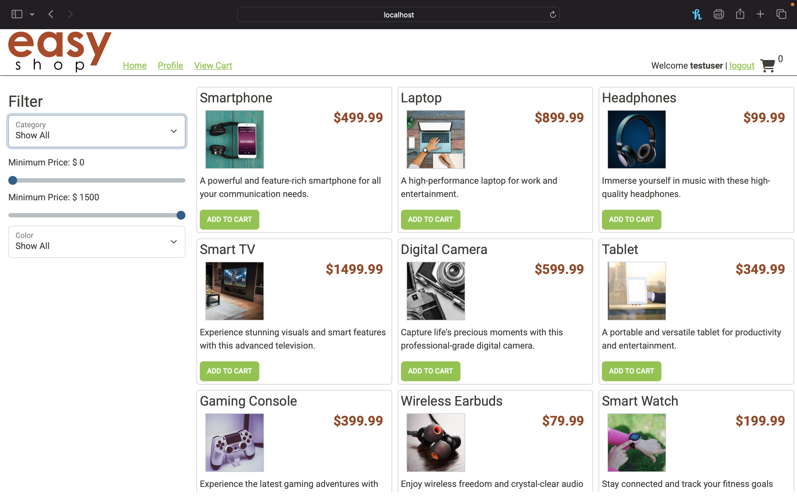
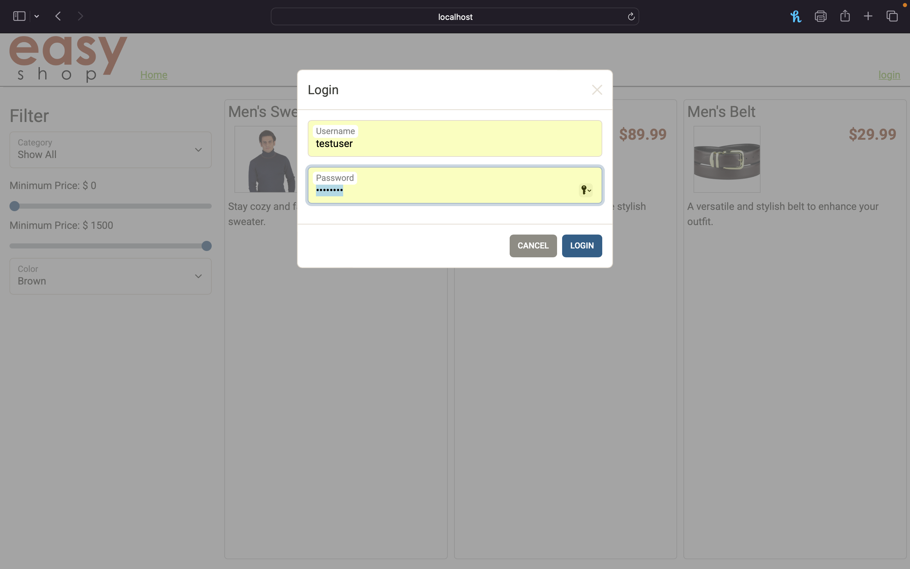
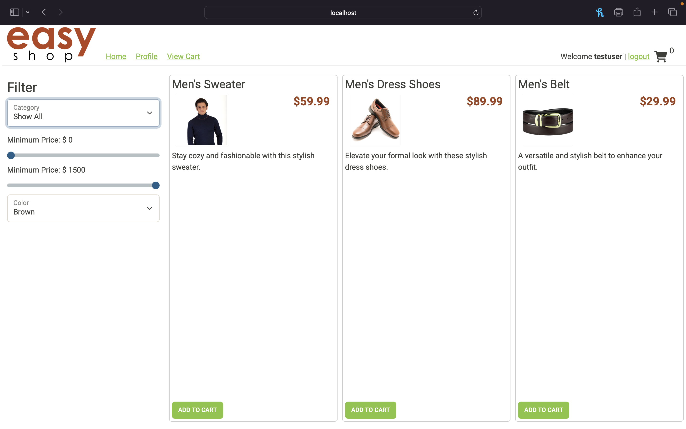
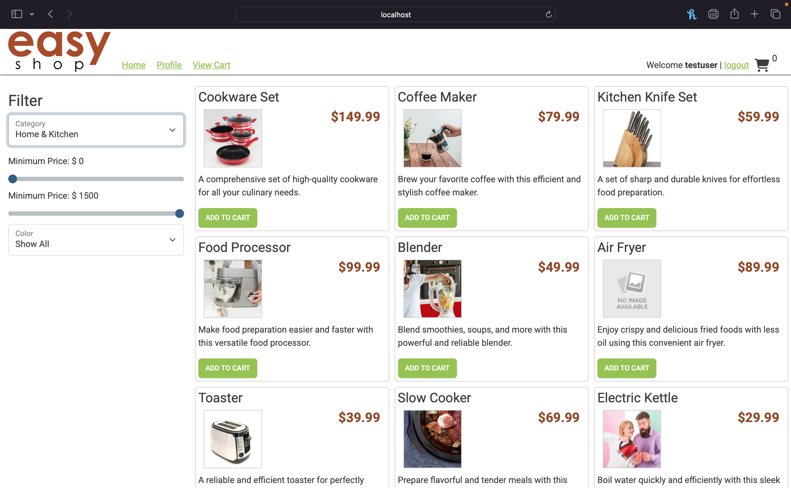

# EasyShop Capstone Project

EasyShop is a modern, full-stack e-commerce web application built as a final capstone for Year Up Java. It features a Java Spring Boot backend and a responsive JavaScript frontend.

## Features

- User authentication (JWT)
- Product browsing & search with filters
- Shopping cart (add/update/remove/clear)
- Secure checkout (API-ready)
- Admin product management (API-ready)
- Mobile-responsive design

## Tech Stack

- **Backend:** Java, Spring Boot, MySQL, JPA
- **Frontend:** JavaScript, HTML, CSS
- **API Testing:** Postman

## How To Run

1. **Backend**
    - Start MySQL and create the schema using provided scripts.
    - Run the Spring Boot application (`EasyshopApplication`).

2. **Frontend**
    - Navigate to `capstone-client-web-application`.
    - Open `index.html` in your browser or run with a simple web server (`python3 -m http.server 8000`).

## Highlights

- RESTful API endpoints for all core features
- Tested all endpoints with Postman
- Integrated JWT-based login and registration
- Full CRUD for products and shopping cart

## Demo
## Screenshots

### Homepage

### Login

### Category Filter Example

### Sorted Product View

## Authors

- Isaac Avila
